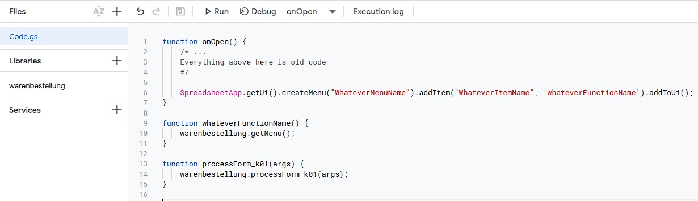

# kenny quick order function

## How to install

1. Add the library to your project. We will assume you named it `warenbestellung`. If this collides with any other libraries, feel free to change that.
   
2. Add this line to your `function onOpen(){}`. All the names starting with `whatever-` can be named whatever you want, but remember what you typed for `whateverFunctionName`.

```js
SpreadsheetApp.getUi().createMenu("WhateverMenuName").addItem("WhateverItemName", 'whateverFunctionName').addToUi();
```

3. Add these lines somewhere in your code (for example `Code.gs`). Make sure the first function has the same name as the one you chose in the previous step. All the other names should be **exactly as shown**.

```js
function whateverFunctionName() {
    warenbestellung.getMenu();
}

function processForm_k01(args) {
    warenbestellung.processForm_k01(args);
}
```

Your whole setup could end up looking like this:




## How to use

- Move to your recent inventory
- Go to the newly created custom menu, click on it.
- Select the sheet and column names as prompted.